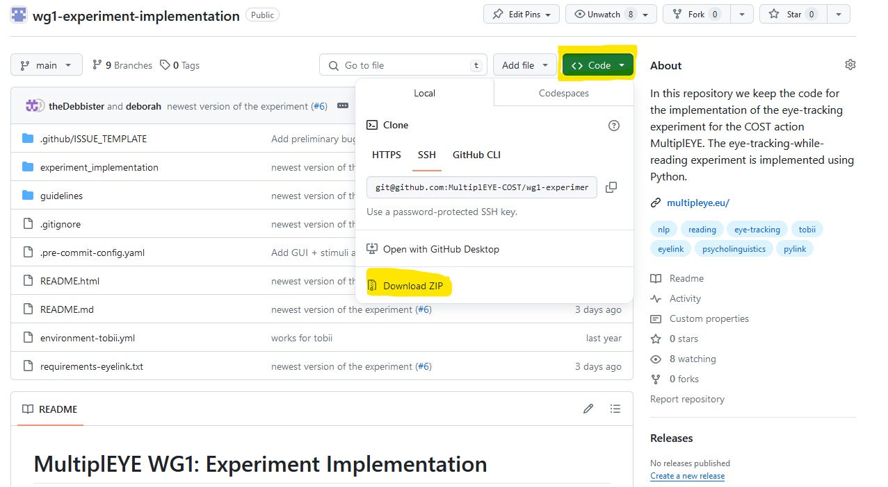

# MultiplEYE WG1: Experiment Implementation

This repository contains the code for a MultiplEYE eye-tracking-while-reading experiment for multiple languages.
After you have read this README make sure to read the relevant files in the guidelines folder. There exists a MARKDOWN 
and a HTML version of the guidelines. Both are exactly the same. You can read whatever format you prefer. Also for this README, 
there exist two versions.

If you would like to contribute, please read the following guidelines: [CONTRIBUTING.md](guidelines/markdown/CONTRIBUTING.md) and
contact [multipleye@cl.uzh.ch](mailto:multipleye@cl.uzh.ch).

> :bangbang::bangbang::bangbang::bangbang:
> **Important**: Please make sure to have the most recent version of the enviornment and the dependencies installed.
> If you have created the env before December 22, 2024, please make sure to update the environment. It is best to just 
> create a new clean env and install all the dependencies again. You do not have to reinstall anaconda or so.

## Contents
- [Installation](#installation)
- [Run the experiment without an eye-tracker](#run-the-dummy-experiment)
- [The result files](#the-result-files)
- [Run the experiment with an eye-tracker](#run-the-experiment-with-an-eye-tracker)


## Installation

In order to run the MultiplEYE experiment you will need to complete the following steps
1. Please read the official MultiplEYE Data Collection Guidelines linked on this page: [MultiplEYE contribute](https://multipleye.eu/contribute/)
2. Download the experiment code from this repository. Either clone via git or download the zip file (see [download as zip](#download-the-experiment-code-as-zip-file)). Please make sure to remove "-main" from the downloaded folder name. The folder should be named `wg1-experiment-implementation`!
3. Following the MultiplEYE Data Collection Guidelines, prepare the stimulus files which includes the creation of the images
4. Copy the stimulus files to the correct location in the experiment data folder: `experiment_implementation/data/[your stimulus folder]`
5. **Mandatory** also for test run: Copy the files (3 Excel files) for the participant questionnaire the to the correct location in the experiment 
data folder. You will have to create a folder for your language and country. The folder should be named as follows:
`experiment_implementation/data/participant_questionnaire_[LANGUAGE_CODE]_[COUNTRY_CODE]_[LAB_NUMBER]/`
6. Optional: if you have created a translation of the interface, you can copy it to this location: 
`experiment_implementation/ui_data/interface_language/[your language]`. The name of the file should be `experiment_interface_[your language].json`.
7. Prepare the environment for the experiment following the guidelines in [CONDA_ENVIRONMENT.md](guidelines/markdown/CONDA_ENVIRONMENT.md)
8. Install the necessary packages for your eye-tracker. For EyeLink eye-trackers 
[INSTALL_PYLINK.md](guidelines/markdown/INSTALL_PYLINK.md). For Tobii eye-trackers, please see [develop for Tobii](#develop-and-run-experiments-for-tobii) further below.
9. [Run the dummy experiment](#run-the-dummy-experiment) to check if everything is working correctly
10. [Run the experiment with an eye-tracker](#run-the-experiment-with-an-eye-tracker)

> If you encounter any problems, please consult this [document](guidelines/markdown/HANDLING_ERRORS.md). If you cannot find your error, contact [multipleye.project@gmail.com](mailto:multipleye.project@gmail.com).

### Download the experiment code as zip file
If you do not have git installed, you can download the code as a zip file from this website.
Click on the green button `Code` and then click on `Download ZIP`. Unzip the folder in our preferred location.

> Note: The repository contains a folder with toy stimuli to test the experiment. Sometimes you cannot unzip these files because the path gets too long.
> In this case, you can either move the folder to a different location closer to the root or unzip and ignore the files
> in the toy stimuli folder (i.e. skip the error message that pops up during unzipping). To use the 
> toy stimuli, please contact [multipleye.project@gmail.com](mailto:multipleye.project@gmail.com) and we can provide them and you can 
> copy them to the correct location.



## Run the dummy experiment
The experiment can be run in dummy mode which means that can be run without an actual eye-tracker.
If you'd like to run it, make sure you have completed the above steps, and you have your conda environment activated.

Activate the environment:

```bash
conda activate multipleye3.9
```

Then you can navigate to the root folder of your local clone of the repository (your path should now end with 
`wg1-experiment-implementation`. Please find instructions on how to navigate in a terminal in the 
[CONDA_ENVIRONMENT.md](guidelines/markdown/CONDA_ENVIRONMENT.md) in section 4). Run the following command to run the dummy experiment:

```bash
python experiment_implementation/start_multipleye_session.py
```

In the GUI that will pop up you can tick the box `Dummy version` to run the experiment in dummy mode.

## The result files
The experiment will write log and data files to a newly created results folder for your language and country
in the data folder (``data/eye_tracking_data...``). 
In there it will create a folder depending on the experiment type. For example, if you run the core session, 
it will create a folder called ``core_dataset``. Within those
folders it will simply create a new folder for each participant. The folder name is the participant ID 
(three-digit number) and information on the language etc. If you run the
script for the core dataset, it will prevent you from running the experiment twice for the same participant. 
Note that if you run a test session, it will not warn you if you enter the same participant ID more than once. It will 
just write the files to the same folder.

The naming scheme of the log files in the `log_files` folder is a follows:
````[log_file_type]_[session_id]_[participant_id]_[date]_[timestamp].txt````.

All logfiles are csv files. Note that the timestamps are relative to the start of the experiment. The experiment starts
at timestamp 0. Those log files are mainly used for debugging purposes.


## Run the experiment with an eye-tracker
In order to run the experiment with an actual eye-tracker you can tick the respective box in the GUI in the lab settings 
section. The box `Dummy version` should be **un-ticked**.

Depending on what eye-tracker you intend to use you need to install the software that comes with the eye-tracker. For 
EyeLink and tobii you can download the software online for free.

If you use a display PC and an external monitor, please start the experiment on the external monitor and 
close the display PC. Otherwise the resolution can be weird for some monitors.

### Run and develop experiments for EyeLink
The code has been tested with EyeLink eye-trackers and mostly on a Windows presentation PC. However, MacOS should work 
as well, but it has not been tested as thoroughly.
You will need to install `pylink` a package provided by SR Research if you use EyeLink eye-trackers.
Note that using pip to install pylink installs a different package although the names are the same! You have to follow 
these step-by-step instructions
of how to install `pylink` can be found here: [INSTALL_PYLINK.md](guidelines/markdown/INSTALL_PYLINK.md)

> Note on pylink experiments: The pixel coordinates written to the edf and consequently asc file will be -1 on both axes due to the EyeLink setting described here: [SR Research Forum Thread](https://www.sr-research.com/support/thread-9129-post-35624.html#pid35624) and is implemented here: [PyGaze](https://github.com/theDebbister/PyGaze/blob/b5771a98d910ce5b29151fc9303c4852d6a62034/pygaze/_eyetracker/libeyelink.py#L217-L219). pymovements will take care of this during preprocessing. 

### Run and develop experiments for Tobii
An early version of the experiment has been tested with tobii eye-trackers. However, the code is not yet fully developed
and tested as the experiment as been developed further since then. If you want to use a tobii eye-tracker, you definitively
need to follow the following steps. Once those are completed, it will still be necessary to adjust the code in order to
work with the tobii eye-trackers: 
1. Install Tobii Pro SDK: [link](https://connect.tobii.com/s/sdk-downloads?language=en_US)
2. Download the SDK
3. Unzip the folder and copy all files from either the '32' or '64' folder to the experiment_implementation folder
4. Then you can pip install the package: ``pip install tobii_research``

### Develop and run experiments for other eye-trackers
Depending on what is needed we can add more eye-trackers. There is also a team that is trying to set up experiment 
using a webcam. Please contact [multipleye.project@gmail.com](mailto:multipleye.project@gmail.com) for more information.

## Upload the data
After you have run a MultiplEYE session, no matter if pilot or real experiment, please make sure to:
1. Always save the entire `data` folder in a safe location locally as you do for other data collections.
2. Upload the participant/session folder to the MultiplEYE server. When you preregistered, you should have 
received a folder where to upload the data. Add the participant/session folder to the eye-tracking-sessions folder. Also add the
session documentation file to the documentation folder in your respective folder. **Please consult Section 14 of the
guidelines for more information on how to upload the data.**
3. Whenever you collect data from a new participant, please upload the entire `data` folder to the server, 
replacing the old one.
