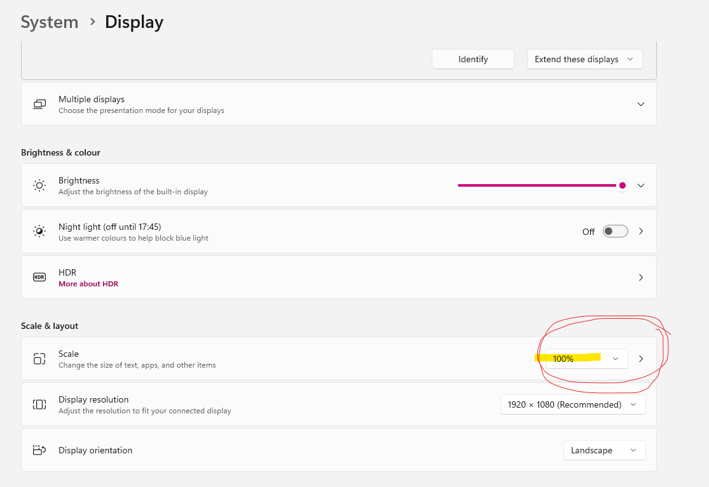

# How to handle common errors

> Please note that whenever you encounter an error, please let us know ([multipleye@cl.uzh.ch](mailto:multipleye@cl.uzh.ch)).
> Oftentimes the error has been encountered before and can be easily fixed. Please do not change the code. If the error
> tells you, for example, that you've entered a wrong value in the GUI you can try and fix it by entering the correct value.
> In any case: write down _exactly_ what steps you took to fix the error and copy paste the output of the GUI window. 

**How are errors displayed and how can you read them!**
- As soon as you start the experiment, a small window will show up with text written in it. See screenshot below (add screenshot)

- This text will show many experiment details that are not relevant but also the error message. Oftentimes, the error
messages contain some useful information that can help you debug the issue. The screenshot below shows an example of an error message:

 

Marked in red is the error type. This is not very relevant for you. It describes the type of the error but if you are 
not familiar with different error types, it is not very helpful.
Marked in yellow is the error message. This is the most important part of the error message. It tells you what went wrong.
In this case the error message is very clear: it tells you that it cannot find a specific file and where it is looking for this file.
For such a scenario we advise you to do the following: Manually follow the path in the error message and check whether the file is there. 
Please read the path carefully. Sometimes there are small mistakes in the path that can be easily overlooked.
Most likely, the file will not be there if the error message says so. In that case you can let us know as the file might
be missing for other labs as well. 

## General procedure
Please follow the following steps when you encounter an error:
1. Copy the ouput of the GUI window and paste it to a file or a text editor
2. Write down what you did before the error occured (i.e. you wanted to run the minimal session, or the test session, or the first time with the eye-tracker...)
3. Read the error message and try to understand what it tells you
4. Try to find out whether what the error message tells you is true (i.e. if it says there is a file missing, 
check whether the file is really missing) without changing any code or file contents!
5. Restart the experiment and very carefully check the details to make sure you did not accidentally enter a wrong value before
6. If it still does not work, please read the guidelines again and check whether you missed a step.
7. Please let us know about the error and attach the output of the GUI window anything you found out about the error message.

## Common errors

### Error: `No such file or directory`
If this is in the error message, it means that the program cannot find the file specified. This can be due to different reasons.
Some of them you can solve yourself, others not.

You can try to find out whether the file or folder the program is looking for is really not there.
If it seems to be there, sometimes, it is helpful to click `edit` on the interface and then check again that everything was entered correctly and then
click `run` again. Even if everything was entered correctly previously, sometimes it can help to simply restart the experiment.

### Image is blurry
If your presentation PC is a Windows machine it is possible that you have to adjust the display settings like in the screenshot below.
Make sure that you select the display that you will run the experiment on! And then adjust the scaling to 100%. 

Another reason for blurry images is that the images were not adjusted to the resolution and size of your display.
Please read the MultiplEYE guidelines on how to create the images adjusted to your display.

### Error: 'No module named pylink' or 'Module pylink cannot be found'
First of all check that you followed the instructions in the `INSTALL_PYLINK.md` file. If you did not, please do so now.

If you did but you used the command to copy it via the commandline: please try and copy it manually.
If you copied it manually and confirm that the folder is in the right location, it could be that there are multiple versions
of anaconda installed on your computer. Please check whether this is the case and if so, delete both of them and 
restart the process in the `CONDA_ENVIRONMENT.md`.

### Other Errors (will be updated soon)
- reaction latency: the experiment is designed such that participants cannot just press space right when the screen appears.
If you test the experiment and it does not immediately react to your keypress, this must not be an error. If the new screen appears, wait a short moment
  (2 seconds are enough) and then press the key. 

